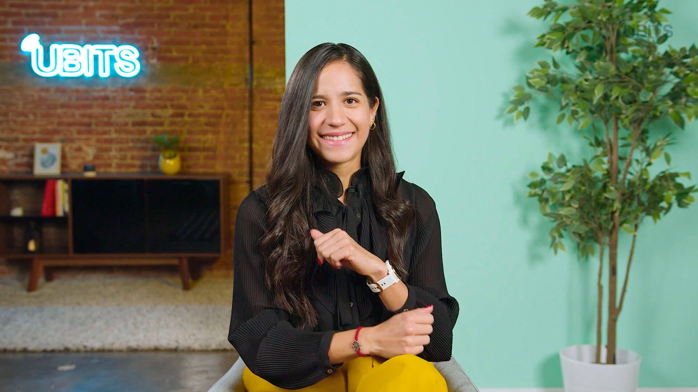

# PROMPT PARA CURSOR - WIDGET DE APRENDIZAJE

## INSTRUCCIONES:
Reemplaza el contenido del widget de aprendizaje (`.widget-learn`) en `profile.html` con el siguiente HTML:

```html
<!-- Header -->
<div class="learn-header">
    <h2 class="ubits-h2">¿Qué quieres aprender hoy?</h2>
    <div class="learn-icon">
        <i class="fa fa-graduation-cap"></i>
    </div>
</div>

<!-- Body con dos secciones -->
<div class="learn-body">
    <!-- Sección izquierda - Plan Activo -->
    <div class="plan-activo">
        <div class="plan-title">
            <i class="fa fa-list"></i>
            <h3 class="ubits-h3">Plan obligatorio UBITS 2025 - 1er semestre</h3>
        </div>
        
        <div class="plan-card">
            <div class="progress-info">
                <span class="ubits-body-md-regular">Progreso total: 180 de 360 minutos</span>
                <span class="ubits-body-md-regular progress-percentage">50%</span>
            </div>
            
            <div class="progress-bar">
                <div class="progress-fill" style="width: 50%; background-color: #febe24;"></div>
            </div>
            
            <div class="plan-dates">
                <p class="ubits-body-md-regular">Inicia: 1 de enero de 2025</p>
                <p class="ubits-body-md-regular">Finaliza: 30 de junio de 2025</p>
            </div>
            
            <div class="plan-time-left">
                <p class="ubits-body-md-regular">Tu plan termina en <strong>8 días</strong></p>
            </div>
            
            <div class="plan-action">
                <button class="btn btn-primary">
                    <span class="ubits-body-md-regular">Ver plan</span>
                    <i class="fa fa-arrow-up-right"></i>
                </button>
            </div>
        </div>
    </div>
    
    <!-- Sección derecha - Recomendado -->
    <div class="recomendado">
        <div class="recomendado-title">
            <i class="fa fa-book"></i>
            <h3 class="ubits-h3">Recomendado para tí</h3>
        </div>
        
        <div class="recomendado-card">
            
            <h4 class="ubits-h4">Implementa el liderazgo colectivo en tu empresa</h4>
            <div class="recomendado-action">
                <button class="btn btn-secondary">
                    <span class="ubits-body-md-regular">Ver más contenidos</span>
                    <i class="fa fa-arrow-up-right"></i>
                </button>
            </div>
        </div>
    </div>
</div>
```

## IMPORTANTE:
- Usa las clases CSS que YA existen en el archivo
- El widget se expandirá automáticamente al contenido
- No modifiques el CSS, solo reemplaza el HTML
- Después de agregar el contenido, ejecuta en la consola: `forceUpdateAllWidgets()` para asegurar que el widget se expanda correctamente
