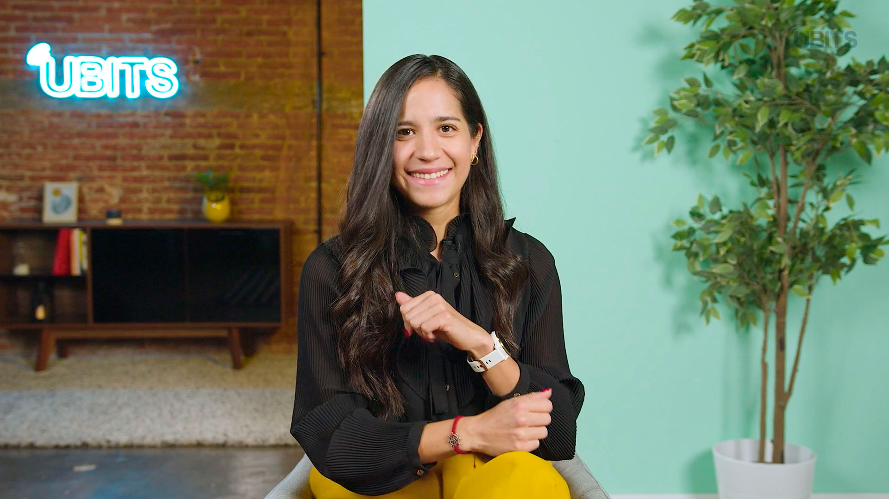

# 🎯 Template UBITS - Crea interfaces en tiempo récord

> **Plantilla para crear interfaces UBITS con Cursor AI en tiempo récord**

## 🚀 ¿Qué es esto?

Una **plantilla lista para usar** que permite a **Product Managers**, **Diseñadores** y **Desarrolladores** crear interfaces UBITS auténticas usando **Cursor AI** sin conocimientos técnicos avanzados.

**El objetivo:** Validar ideas rápidamente, prototipar interfaces en tiempo récord y obtener feedback real de usuarios.

## 🚨 **ANTES DE EMPEZAR - LEE ESTO:**

1. **📋 Lee `CURSOR-RULES.md`** - Reglas obligatorias para Cursor AI
2. **🎯 Edita `index.html`** - Tu página principal (se despliega en Netlify)
3. **📄 Usa `plantilla-ubits.html`** - Para crear páginas nuevas
4. **👀 Mira `ejemplos-tokens.html`** - Ejemplos que funcionan (copia, no inventes)
5. **🎨 Usa SOLO tokens UBITS** - `var(--ubits-...)` NUNCA colores hardcodeados

## 📋 Flujo de Trabajo

### **Para tu proyecto principal:**
- **Edita `index.html`** directamente - Esta será tu página principal
- **Se despliega automáticamente** en Netlify como página de inicio

### **Para páginas adicionales:**
- **Usa `plantilla-ubits.html`** como base
- **Cursor AI puede clonarla** y crear nuevas páginas
- **Mantén la consistencia** del template UBITS

## 📁 Estructura del Proyecto

```
Template UBITS/
├── 📄 index.html              # Dashboard principal (plantilla base)
├── 📄 profile.html            # Página de perfil (vacía)
├── 📄 ubits-ai.html           # Plantilla para UBITS AI
├── 📄 simon-chat.html         # Chat específico de Simon
├── 📄 componentes.html        # Página de documentación de componentes
├── 📄 sidebar.html            # Documentación del componente Sidebar
├── 📁 components/             # Sistema de componentes
│   ├── sidebar.html           # Componente sidebar
│   └── sidebar.js             # Cargador del sidebar
├── 📁 docs/                   # Componentes de documentación
│   ├── docs-sidebar.js        # Sidebar de navegación para documentación
│   └── docs-sidebar.css       # Estilos del sidebar de documentación
├── 🎨 styles.css              # Estilos del dashboard principal
├── 🎨 profile.css             # Estilos de la página de perfil
├── 🎨 ubits-typography.css    # Sistema de tipografía UBITS
├── 🎨 fontawesome-icons.css   # Iconos FontAwesome
├── ⚙️ script.js               # Funcionalidad JavaScript
├── 🖼️ images/                 # Recursos visuales
│   ├── Ubits-logo.svg
│   ├── Profile-image.jpg
│   ├── cards-learn/
│   └── empty-states/
├── 📚 Fonts/                  # Fuentes FontAwesome
├── 📖 iconos.html                    # Catálogo de iconos
├── 🎨 colores.html                   # Catálogo de tokens de color UBITS
├── 📝 guia-prompts.html              # Guía de prompts para Cursor AI
├── 🚨 alert.html                     # Demostración del componente Alert
├── 📋 WIDGET-GUIDE.md         # Guía para llenar widgets
├── 📝 UBITS-TYPOGRAPHY-GUIDE.md      # Guía de tipografía
└── 📄 LICENSE                 # Licencia MIT
```

## 🚀 Cómo usar esta plantilla

1. **Descarga:** Haz clon o descarga como ZIP
2. **Personaliza:** Modifica según tus necesidades
3. **Usa:** Despliega en tu propio hosting

> **Nota:** Esta es una plantilla de solo lectura. Para personalizarla, clona o haz fork del repositorio.

## 📚 Páginas de Documentación

### **componentes.html**
- **Propósito:** Página principal de documentación de componentes
- **Contenido:** Introducción y navegación a todos los componentes
- **Sidebar:** Navegación entre secciones de documentación

### **sidebar.html**
- **Propósito:** Documentación específica del componente Sidebar
- **Contenido:** Preview interactivo, características y documentación técnica
- **Features:** Preview funcional con controles, acordeón técnico colapsable

### **Sistema de Documentación**
- **Sidebar de navegación:** Componente reutilizable para páginas de docs
- **Responsive:** Se adapta a móvil con dropdown
- **Scroll behavior:** Se estira cuando el top-nav se oculta
- **Navegación fluida:** Entre páginas de documentación

## 🎯 Casos de uso reales

- **Product Managers:** Crear mockups de nuevas funcionalidades
- **Diseñadores:** Prototipar interfaces sin código
- **Equipos de producto:** Validar ideas con usuarios reales
- **Consultores:** Mostrar propuestas de interfaz a clientes
- **Desarrolladores:** Crear MVPs visuales rápidamente

## 🎨 Componentes UBITS incluidos

### **Páginas base:**
- **`index.html`** - Dashboard principal con content-wrapper (plantilla base)
- **`profile.html`** - Página de perfil con widgets vacíos y sidebar derecho
- **`ubits-ai.html`** - Plantilla específica para UBITS AI
- **`simon-chat.html`** - Chat específico de Simon

### **Catálogos de recursos:**
- **`colores.html`** - Catálogo completo de tokens de color UBITS (light + dark mode)
- **`iconos.html`** - Catálogo de iconos FontAwesome organizados por categorías

### **Componentes reutilizables:**
- **Sidebar** - Componente de navegación lateral (`components/sidebar.js`)
- **Top-Nav** - Componente de navegación superior (`components/top-nav.js`)
  - **Variantes disponibles:**
    - `template` - Plantilla con 5 secciones de ejemplo (personalizable)
    - `learning` - Aprendizaje (Home, Catálogo, Universidad, etc.)
    - `performance` - Desempeño (Evaluaciones 360, Objetivos)
    - `surveys` - Encuestas (una sola pestaña)
    - `tasks` - Tareas (Planes, Tareas)
- **Tab-Bar** - Componente de navegación móvil (`components/tab-bar.js`)
  - **Navegación móvil** - Se muestra automáticamente en pantallas pequeñas
  - **Tabs incluidos:** Módulos, Mi perfil, Modo oscuro
  - **Responsive** - Reemplaza el sidebar en dispositivos móviles

### **Plantilla con componentes UBITS:**
- **Widgets flexibles** - Se adaptan automáticamente al contenido
- **Tokens de color** - Cambian automáticamente entre modo claro/oscuro
- **Tipografía oficial** - Noto Sans con todas las variantes
- **Iconos FontAwesome** - Catálogo completo integrado
- **Scroll de Página** - Funciona correctamente en todas las páginas
- **CSS organizado** - Estilos del sidebar en `styles.css`, específicos en `profile.css`
- **Modo Oscuro** - Soporte completo para tema oscuro

### **Diseño Responsive:**
- **Páginas responsive** - `index.html`, `profile.html`, `ubits-ai.html` adaptadas a móviles
- **Tab-bar móvil** - Navegación optimizada para pantallas pequeñas
- **Breakpoints** - 1023px (tablet), 768px (móvil), 480px (móvil pequeño)
- **Sidebar adaptativo** - Se oculta en móviles, reemplazado por tab-bar
- **Layout flexible** - Se adapta automáticamente a cualquier tamaño de pantalla

### **Catálogo de colores UBITS:**
- **`colores.html`** - Catálogo visual completo de todos los tokens de color
- **Layout mejorado** - Cuadrito de color + nombre del token a la izquierda, hexadecimal a la derecha
- **Modo dual** - Visualización simultánea de light y dark mode
- **Fácil consulta** - Todos los tokens organizados por categorías (BRAND, FOREGROUND, BACKGROUND, BORDER, FEEDBACK, etc.)
- **Referencia rápida** - Para Product Managers y Diseñadores que necesitan ver los colores disponibles

### **Guía de prompts UBITS:**
- **`guia-prompts.html`** - Prompts para usar en Cursor AI
- **4 prompts especializados** - Clonar, crear página inicio, crear páginas, actualizar
- **Copy to clipboard** - Botones de copia con feedback visual
- **Toast notifications** - Confirmación de copia exitosa
- **Personalización requerida** - Algunos prompts necesitan ajustes antes de usar
- **Sin conocimiento técnico** - Para Product Managers y Diseñadores
- **Diseño 100% UBITS** - Colores, tipografía y componentes oficiales

### **Componente Alert UBITS:**
- **`alert.html`** - Demostración del componente Alert con 4 variaciones
- **4 variaciones** - Success (verde), Info (azul), Warning (amarillo), Error (rojo)
- **JavaScript completo** - Clase UBITSAlert con métodos para crear, cerrar y gestionar alertas
- **Demo interactivo** - Crea alertas dinámicamente con diferentes opciones
- **Tokens UBITS** - Usa colores oficiales de feedback del sistema UBITS
- **Responsive** - Se adapta perfectamente a móviles y desktop

### **Sistema de tipografía UBITS:**
- **`ubits-typography.css`** - Todas las clases de tipografía disponibles
- **Display:** d1, d2, d3, d4 (regular, semibold, bold)
- **Headings:** h1, h2 (SOLO ESTOS DOS EXISTEN)
- **Body:** md, sm (regular, semibold, bold)
- **Regla crítica:** SIEMPRE verificar que la clase existe antes de usarla

### **⚠️ REGLAS CRÍTICAS DE TIPOGRAFÍA:**
- ❌ **NUNCA usar:** `ubits-heading-h3`, `ubits-heading-h4`, `ubits-heading-h5`, `ubits-heading-h6` (NO EXISTEN)
- ✅ **Para subtítulos:** Usar `ubits-body-md-bold` o `ubits-body-sm-bold`
- ✅ **Para títulos de sección:** Usar `ubits-body-md-bold` para títulos pequeños
- ✅ **Para títulos de pasos:** Usar `ubits-body-md-bold` para pasos de proceso
- ✅ **Para títulos de cards:** Usar `ubits-body-md-bold` para títulos de componentes

## 🎨 **VALOR DIFERENCIAL DEL PROYECTO**

> **🚨 REGLA FUNDAMENTAL: SIEMPRE usar tokens de color UBITS y tipografía UBITS**
> 
> **Este es el valor diferencial del template.** Cualquiera puede usar Cursor AI, pero la ventaja de esta plantilla es que garantiza que todas las interfaces creadas mantengan la identidad visual oficial de UBITS con:
> - **Tokens de color** que cambian automáticamente entre modo claro y oscuro
> - **Tipografía oficial** UBITS con todas las variantes
> - **Iconos FontAwesome** integrados y organizados
> - **Consistencia visual** en todas las experiencias creadas

## 🤖 Instrucciones para Cursor AI

### **📋 Reglas Importantes**

#### ✅ **SIEMPRE Hacer (OBLIGATORIO):**
1. **Usar tokens de color UBITS** - `var(--ubits-fg-1-high)`, `var(--ubits-bg-1)`, etc. NUNCA colores hardcodeados
2. **Usar la tipografía UBITS** - Aplicar clases como `ubits-h3`, `ubits-body-md-regular`
3. **Usar `box-sizing: border-box`** - Para cálculos correctos de tamaño
4. **Usar iconos outline** - Usar `far` (FontAwesome Regular) para iconos outline (ej: `far fa-home`, `far fa-book`)
5. **Probar en `index.html`** - Usar este archivo como referencia
6. **Mantener la funcionalidad** - No romper el JavaScript existente
7. **Importar `ubits-colors.css`** - En cualquier nuevo archivo HTML que crees

#### ⚠️ **RECOMENDADO (pero flexible):**
1. **Usar las clases CSS existentes** - Para mantener consistencia
2. **Mantener el padding de 16px** - Para espaciado uniforme
3. **Usar `display: flex`** - Para layouts flexibles
4. **Mantener `overflow: hidden`** - Para control de contenido

#### ❌ **EVITAR (solo si es absolutamente necesario):**
1. **Usar colores hardcodeados** - SIEMPRE usar tokens UBITS (`var(--ubits-...)`)
2. **Cambiar fuentes** - Mantener la tipografía UBITS
3. **Romper el JavaScript** - Mantener la funcionalidad del sidebar y tooltips
4. **Crear interfaces sin tokens** - Esto elimina el valor diferencial del proyecto

### **🔧 Personalización del Top-Nav:**
Para personalizar el top-nav, usa la variante `template` que incluye 5 secciones de ejemplo:

```javascript
// Cargar top-nav personalizado
loadTopNav('top-nav-container', 'template', [
    { id: 'mi-seccion', label: 'Mi Sección', icon: 'far fa-home' },
    { id: 'otra-seccion', label: 'Otra Sección', icon: 'far fa-book' }
]);
```

**Instrucciones para Cursor:**
- "Cambia las secciones del top-nav por: [lista de secciones con nombres e iconos]"
- "Usa iconos outline con `far` (ej: `far fa-home`, `far fa-book`)"
- "Mantén la estructura de datos: { id, label, icon }"

## 🎨 Sistema de Clases

### **Widgets Principales:**
```css
.widget-user-info     /* Información Personal */
.widget-org          /* Organización */
.widget-learn        /* Aprendizaje */
.widget-objectives   /* Objetivos */
.widget-surveys      /* Encuestas */
.widget-assessments  /* Assessments */
.widget-evaluations  /* Evaluaciones */
.right-sidebar-fixed /* Sidebar Derecho */
.content-wrapper     /* Contenedor principal (index.html) */
```

### **Tipografía UBITS:**
```css
ubits-h1, ubits-h2, ubits-h3     /* Títulos */
ubits-body-md-regular            /* Texto normal */
ubits-body-sm-regular            /* Texto pequeño */
ubits-body-xs-regular            /* Texto muy pequeño */
```

### **Tokens de Color UBITS (OBLIGATORIO):**
```css
/* NUNCA usar colores hardcodeados, SIEMPRE usar estos tokens: */
var(--ubits-fg-1-high)        /* Texto principal */
var(--ubits-fg-1-medium)      /* Texto secundario */
var(--ubits-fg-2-high)        /* Texto destacado */
var(--ubits-fg-2-medium)      /* Texto gris */
var(--ubits-bg-1)             /* Fondo principal (blanco/oscuro) */
var(--ubits-bg-2)             /* Fondo secundario */
var(--ubits-accent-brand)     /* Azul UBITS */
var(--ubits-sidebar-bg)       /* Fondo del sidebar */
var(--ubits-sidebar-button-fg-default)  /* Iconos sidebar */
/* Y muchos más... ver ubits-colors.css */
```

### **🎨 REGLA DE COLORES POR DEFECTO (OBLIGATORIO):**
```css
/* Por defecto, TODOS los textos deben usar estos tokens: */
/* Headings y Display: */
color: var(--ubits-fg-1-high);

/* Body y textos normales: */
color: var(--ubits-fg-1-medium);
```

**Aplicar automáticamente:**
- **Títulos (h1, h2, h3, h4, h5, h6)**: `var(--ubits-fg-1-high)`
- **Display (ubits-display-*)**: `var(--ubits-fg-1-high)`
- **Body (ubits-body-*)**: `var(--ubits-fg-1-medium)`
- **Textos normales**: `var(--ubits-fg-1-medium)`

### **Importar Tokens (OBLIGATORIO en nuevos archivos):**
```html
<link rel="stylesheet" href="ubits-colors.css">
```

## 🛠️ Cómo Usar con Cursor AI

### **1. Para Product Managers:**
```bash
# Abre Cursor en esta carpeta
# Usa el prompt:
"Llena el widget de [nombre] en profile.html con [tu contenido]"
```

### **2. Para Diseñadores:**
```bash
# Consulta los estilos disponibles:
# - Abre UBITS-TYPOGRAPHY-GUIDE.md
# - Abre iconos.html
# - Abre colores.html (catálogo visual de tokens)
# - Usa las clases predefinidas
```

### **3. Para Desarrolladores:**
```bash
# Personaliza los estilos:
# - Modifica profile.css para nuevos widgets
# - Usa ubits-typography.css para textos
# - Agrega funcionalidad en script.js
```

## 📋 Widgets Disponibles

| Widget | Clase CSS | Descripción |
|--------|-----------|-------------|
| **Información Personal** | `.widget-user-info` | Datos del usuario |
| **Organización** | `.widget-org` | Información de la empresa |
| **Aprendizaje** | `.widget-learn` | Contenido educativo |
| **Objetivos** | `.widget-objectives` | Metas y objetivos |
| **Encuestas** | `.widget-surveys` | Formularios y encuestas |
| **Assessments** | `.widget-assessments` | Evaluaciones |
| **Evaluaciones** | `.widget-evaluations` | Resultados |
| **Sidebar Derecho** | `.right-sidebar-fixed` | Panel lateral |

## 🎯 Características Principales

### ✅ **Robusto y Flexible:**
- Los widgets se adaptan automáticamente al contenido
- No se rompe sin importar qué pongas dentro
- Altura mínima garantizada con `<br>` tags
- Overflow controlado
- **Scroll de página** - Funciona correctamente en todas las resoluciones

### ✅ **Mantiene el Estilo UBITS:**
- Colores oficiales de UBITS
- Tipografía consistente
- Espaciado correcto
- Bordes y sombras apropiados

### ✅ **Fácil de Personalizar:**
- Clases CSS claras y descriptivas
- Documentación completa
- Ejemplos de código
- Guías paso a paso

### ✅ **Sidebar Personalizable:**
- **Sin elementos activos por defecto** - Cada PM puede activar el botón de su área
- **Navegación integrada:**
  - **Logo UBITS** → Navega a `index.html`
  - **Avatar de usuario** → Navega a `profile.html`
  - **Botón UBITS AI** → Navega a `ubits-ai.html`
  - **Card Simon** (en ubits-ai.html) → Navega a `simon-chat.html`
- **Ejemplo de uso**: PM de Aprendizaje activa el botón "Aprendizaje"
- **Flexible**: Se adapta a cualquier equipo o departamento
- **Consistente**: Mantiene el diseño UBITS en todas las áreas

### ✅ **Altamente Personalizable:**
- **Estructura flexible** - Puedes modificar layouts, agregar secciones, cambiar tamaños
- **Widgets adaptables** - Se expanden automáticamente al contenido
- **CSS modular** - Fácil de personalizar sin romper la funcionalidad
- **Solo respeta** colores y tipografía UBITS (pero incluso estos son modificables si es necesario)

### ✅ **Completamente Responsive:**
- **Páginas móviles** - `index.html`, `profile.html`, `ubits-ai.html` optimizadas para móviles
- **Tab-bar automático** - Navegación móvil que reemplaza el sidebar en pantallas pequeñas
- **Breakpoints inteligentes** - Adaptación automática a diferentes tamaños de pantalla
- **Touch-friendly** - Botones y elementos optimizados para dispositivos táctiles
- **Performance móvil** - Carga rápida y navegación fluida en dispositivos móviles

### ✅ **Sistema de Componentes:**
- **Componentes reutilizables** - Modifica una vez, se actualiza en todos lados
- **KISS (Keep It Simple)** - Fácil de entender y usar
- **Escalable** - Fácil agregar nuevos componentes
- **Sin dependencias** - Solo HTML + JavaScript vanilla

## 🚀 Ejemplos de Uso

### **Llenar un Widget Simple:**
```html
<div class="widget-objectives">
    <h3 class="ubits-h3">Mis Objetivos</h3>
    <p class="ubits-body-md-regular">Completar el curso de liderazgo</p>
    <button class="btn-secondary">Ver Detalles</button>
</div>
```

### **Agregar una Imagen:**
```html
<div class="widget-learn">
    
    <h3 class="ubits-h3">Nuevo Curso</h3>
</div>
```

### **Agregar un Botón:**
```html
<button class="btn-secondary">
    Ver más
    <i class="fas fa-arrow-up-right" style="margin-left: 8px;"></i>
</button>
```

### **Activar Sidebar para tu Área:**
```html
<!-- Para PM de Aprendizaje -->
<button class="nav-button active" data-section="aprendizaje" data-tooltip="Aprendizaje">
    <i class="fa fa-graduation-cap"></i>
</button>

<!-- Para PM de Encuestas -->
<button class="nav-button active" data-section="encuestas" data-tooltip="Encuestas">
    <i class="fa fa-clipboard-list-check"></i>
</button>
```

### **Usar el Sistema de Componentes:**
```html
<!-- En cualquier archivo HTML -->
<div id="sidebar-container"></div>
<div id="tab-bar-container"></div>

<script src="components/sidebar.js"></script>
<script src="components/tab-bar.js"></script>
<script>
    // Cargar sidebar sin botón activo
    loadSidebar();
    
    // Cargar tab-bar (se muestra automáticamente en móviles)
    loadTabBar('tab-bar-container');
    
    // O cargar sidebar con botón activo
    loadSidebar('ubits-ai');
    
    // Cambiar botón activo dinámicamente
    updateActiveSidebarButton('aprendizaje');
</script>
```

## 🎯 Ejemplos de Prompts para Cursor

### **Llenar un Widget:**
```
"Llena el widget de objetivos en profile.html con una lista de 3 objetivos usando las clases UBITS"
```

### **Agregar una Imagen:**
```
"Agrega una imagen del curso en el widget de aprendizaje de profile.html usando la imagen de cards-learn"
```

### **Crear un Botón:**
```
"Agrega un botón 'Ver más' en el widget de encuestas de profile.html con el estilo UBITS"
```

## 🚨 Solución de Problemas

### **Si un widget se ve mal:**
1. Verificar que tiene `display: flex` y `flex-direction: column`
2. Asegurar que tiene `padding: 16px`
3. Confirmar que tiene `box-sizing: border-box`
4. Revisar que no hay `height` fija, solo `<br>` tags para espacio

### **Si el contenido se sale:**
1. Agregar `overflow: hidden` al widget
2. Verificar que las imágenes tienen `width: 100%`
3. Asegurar que el texto no es demasiado largo

### **Si los colores no coinciden:**
1. **Verificar que usas tokens UBITS** - `var(--ubits-fg-1-high)` en lugar de `#303a47`
2. **Importar `ubits-colors.css`** - En cualquier archivo HTML nuevo
3. **Usar las clases de tipografía UBITS** - `ubits-h3`, `ubits-body-md-regular`
4. **Revisar el archivo `ubits-colors.css`** - Para ver todos los tokens disponibles

## 📚 Documentación

- **`WIDGET-GUIDE.md`** - Guía completa para llenar widgets
- **`UBITS-TYPOGRAPHY-GUIDE.md`** - Sistema de tipografía
- **`iconos.html`** - Catálogo de iconos
- **`colores.html`** - Catálogo visual de tokens de color UBITS

## 🎨 Personalización Avanzada

### **Agregar Nuevos Widgets:**
1. Crea el HTML en `index.html`
2. Agrega los estilos en `styles.css` o `profile.css`
3. Sigue el patrón de los widgets existentes
4. **Flexible**: Puedes crear cualquier estructura que necesites

### **Modificar Layouts:**
1. **Cambiar tamaños** - Modifica `width`, `height`, `padding`, `margin`
2. **Agregar secciones** - Crea nuevas filas o columnas
3. **Reorganizar elementos** - Mueve widgets donde necesites
4. **Responsive** - Ajusta para diferentes pantallas

### **Personalizar Estilos:**
1. **Colores** - Usa los oficiales UBITS, pero puedes cambiarlos si es necesario
2. **Tipografía** - Usa las clases UBITS, pero puedes modificar si es requerido
3. **Espaciado** - Ajusta `padding`, `margin`, `gap` según necesites
4. **Bordes y sombras** - Personaliza `border-radius`, `box-shadow`

### **Agregar Funcionalidad:**
1. Modifica `script.js`
2. Agrega event listeners
3. Mantén la compatibilidad con el sistema
4. **JavaScript modular** - Fácil de extender

### **Reglas de Oro:**
- **SÉ CREATIVO** - La plantilla está diseñada para ser flexible
- **USA TOKENS UBITS** - Este es el valor diferencial del template
- **Mantén la funcionalidad** - No rompas el JavaScript del sidebar
- **Consistencia visual** - Garantiza que todas las interfaces se vean como UBITS
- **Prueba todo** - Usa `index.html` para experimentar

### **Reglas de Escritura:**
- **Títulos**: Solo la primera letra en mayúscula (ej: "Sistema de diseño completo")
- **Nombres propios**: Primera letra de cada palabra en mayúscula (ej: "Cursor AI", "FontAwesome")
- **UBITS**: Siempre todo en mayúsculas (ej: "Template UBITS", "tokens UBITS")

### **Principio KISS:**
- **Keep It Simple, Stupid** - Siempre busca la solución más simple
- **Código limpio y directo** - Evita complejidad innecesaria
- **Funciones pequeñas** - Una función, una responsabilidad
- **Nombres claros** - `navigateToTab()` mejor que `handleNavigationEvent()`

## 🤝 Soporte

- **Documentación:** Revisa las guías incluidas
- **Ejemplos:** Usa `profile.html` como referencia
- **Iconos:** Consulta `iconos.html`
- **Estilos:** Revisa `ubits-typography.css`

## 🗺️ Navegación del Proyecto

### **Páginas Principales:**
- **[index.html](index.html)** - Página principal (edita aquí tu proyecto)
- **[plantilla-ubits.html](plantilla-ubits.html)** - Plantilla base para crear nuevas páginas
- **[profile.html](profile.html)** - Página de perfil
- **[ubits-ai.html](ubits-ai.html)** - Dashboard de IA
- **[simon-chat.html](simon-chat.html)** - Chat de Simon

### **Catálogos de Recursos:**
- **[colores.html](colores.html)** - Catálogo visual de tokens de color UBITS
- **[iconos.html](iconos.html)** - Catálogo de iconos FontAwesome

## 📄 Licencia

Este proyecto está bajo la licencia MIT incluida en el archivo `LICENSE`.

---

**¡Listo para crear interfaces UBITS increíbles! 🚀**